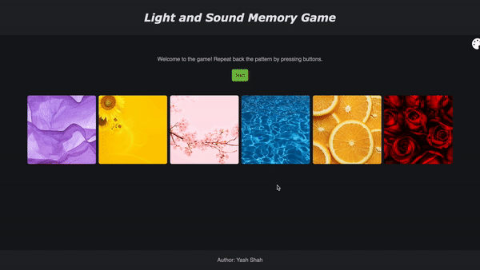

# Pre-work - _Memory Game_

**Memory Game** is a Light & Sound Memory game to apply for CodePath's SITE Program.

Submitted by: **Yash Shah**

Time spent: **9** hours spent in total

Link to project: [https://glitch.com/edit/#!/traveling-artistic-jet?path=README.md%3A1%3A0](https://glitch.com/edit/#!/traveling-artistic-jet?path=README.md%3A1%3A0)

## Required Functionality

The following **required** functionality is complete:

- [x] Game interface has a heading (h1 tag), a line of body text (p tag), and four buttons that match the demo app
- [x] "Start" button toggles between "Start" and "Stop" when clicked.
- [x] Game buttons each light up and play a sound when clicked.
- [x] Computer plays back sequence of clues including sound and visual cue for each button
- [x] Play progresses to the next turn (the user gets the next step in the pattern) after a correct guess.
- [x] User wins the game after guessing a complete pattern
- [x] User loses the game after an incorrect guess

The following **optional** features are implemented:

- [x] Any HTML page elements (including game buttons) has been styled differently than in the tutorial
- [ ] Buttons use a pitch (frequency) other than the ones in the tutorial
- [x] More than 4 functional game buttons
- [x] Playback speeds up on each turn
- [x] Computer picks a different pattern each time the game is played
- [x] Player only loses after 3 mistakes (instead of on the first mistake)
- [x] Game button appearance change goes beyond color (e.g. add an image)
- [x] Game button sound is more complex than a single tone (e.g. an audio file, a chord, a sequence of multiple tones)
- [ ] User has a limited amount of time to enter their guess on each turn

The following **additional** features are implemented:

- [x] The app has two themes - a dark mode and a light mode

## Video Walkthrough

Here's a walkthrough of implemented user stories:

GIF showing a winning game:  

GIF showing a losing game:  

GIF showing changing the color theme:  

## Reflection Questions

1) If you used any outside resources to help complete your submission (websites, books, people, etc) list them here.

-> I used StackOverflow when I encountered a bug while implementing EventListeners.

2) What was a challenge you encountered in creating this submission (be specific)? How did you overcome it? (recommended 200 - 400 words)

-> One challenge that I encountered while creating the submission was when I tried keeping HTML and JavaScript separate from each other.
Instead of adding events in the form of `onclick`s or `onmouseup`s directly in the HTML inside the `<button>` tags, I added EventListeners in JavaScript by calling the object using `document.getElementById("xxx").addEventListener("click", function)`.
I knew how to link functions to EventListeners which did not need any arguments to be passed to them at the time of function calling.
However, when I needed to call functions like `guess` and `startTone` wherein I had to pass the button number as an argument,
if I directly linked `guess(1)` in the EventListener, it would parse through and execute the function since it thought that I meant to call it.
At first, I did not know why this was happening when I saw repeated function calls being made in the Dev Console before even starting the game.
As I added more debug messages within the script to find out where and why it was happening, I found out it was because I was unknowingly calling the function instead of just passing in the function definition.
So, to solve the problem, I created a dummy arrow function `() => { … };` wherein I called the function, for e.g. guess(1), inside this dummy function.
Using this solution had a two-fold outcome.
Firstly, it solved the original problem that I had to come with a solution for.
Secondly, I got to learn about creating and using arrow functions, how they can be helpful, and to understand this subtlety while incorporating EventListeners in JavaScript.

3) What questions about web development do you have after completing your submission? (recommended 100 - 300 words)

-> Some questions that I have about web development after completing my project are:
- I have heard about many places that allow hosting of websites like Heroku, Firebase, etc. How are domain names looked upon by the computer industry? Are custom domains preferred and seen as a good sign over using default domains provided by hosting platforms?
- What role does the backend play in web development? What do servers and server-side languages accomplish?
- When learning to become a Full-Stack Software Engineer, there are a lot of ways to about learning like MEAN, MERN, Ruby on Rails, etc. While it is important to have working knowledge of most of these languages and it should not be an either-or, what would you recommend learning first and given what advantages?
- Testing is really important in any field and given testing libraries and frameworks like Jest, Cypress, JSDOM, Google Lighthouse Tests, etc., how heavily should software be tested so that it is verifiable as well as shippable on time?

4) If you had a few more hours to work on this project, what would you spend them doing (for example: refactoring certain functions, adding additional features, etc). Be specific. (recommended 100 - 300 words)

-> I have tried my best to make my code as readable as possible. I have added comments and JSDoc annotations to all classes and major functions in CSS and JavaScript, I have made use of CSS variables by defining `:root` inside `styles.css` so that I can reuse colors. I have also tried keeping HTML, CSS, and JavaScript separate and independent of each other.

Given more time, I would definitely first try to do proper unit testing via Jest, end-to-end testing using Cypress, and perform some Google Lighthouse Tests to see any places where I can optimize the code for better performance and accessibility. I would also like to setup a pipeline for the project that enforces linting of code for style and runs unit tests before allowing to merge the new code with the original code. I would like to setup a place like GitHub pages to show JSDoc documentation for the source code. If I get done with these, I will then move on to add more features like adding a ticking clock and limiting the time a user has to guess.

## License

    Copyright Yash Shah

    Licensed under the Apache License, Version 2.0 (the "License");
    you may not use this file except in compliance with the License.
    You may obtain a copy of the License at

        http://www.apache.org/licenses/LICENSE-2.0

    Unless required by applicable law or agreed to in writing, software
    distributed under the License is distributed on an "AS IS" BASIS,
    WITHOUT WARRANTIES OR CONDITIONS OF ANY KIND, either express or implied.
    See the License for the specific language governing permissions and
    limitations under the License.
